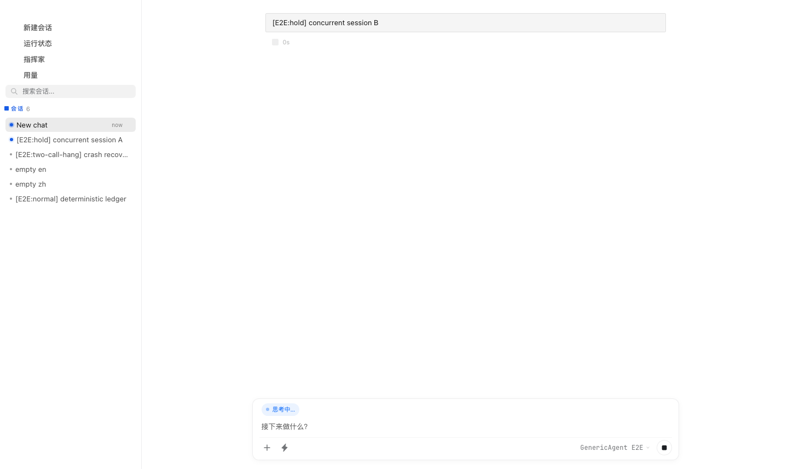
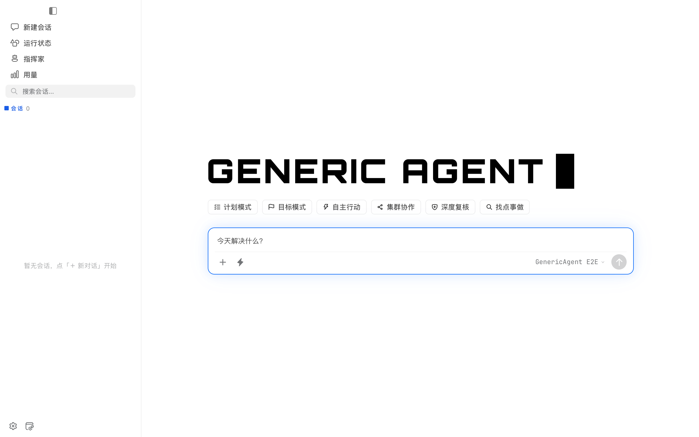
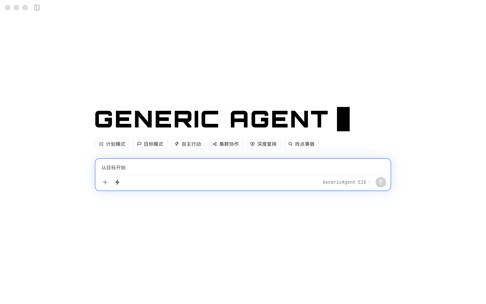

# GenericAgent Desktop 下一阶段实践与验收报告

日期：2026-08-28  
基线：`e7bfb038b972c7cc5fda7134c777ef2df7ac222d`  
集成分支：`codex/desktop-next-phase-integration`

## 1. 验收结论

两项源码功能已经从指定基线完成、集成并通过组件、类型、Python、Rust、打包规则、浏览器 E2E 和 macOS 原生 Tauri E2E。集成过程中发现并修复了两个测试基础设施问题：成功运行证据的保留条件偏离 CI 契约，以及 WebKit 对滚动弹窗内设置项的 `isDisplayed()` 误判。

本轮可以作为 fork 上的源码评审候选。发布前仍保留两个人工平台门禁：

1. macOS Finder 向正式签名包实拖 PNG、TXT、PDF，并分别覆盖 sidebar 展开和折叠。
2. Windows Explorer 向 Windows 包实拖同类文件。

当前主机只有 macOS。隔离 QA 包、Finder 夹具和 Composer 均已实际启动，但桌面控制接口会把拖拽终点限制在发起应用窗口内，无法制造 Finder 到 GenericAgent 的跨进程鼠标拖放。因此本报告不把该尝试记为产品通过或失败，也不以 DOM 合成事件冒充真包实拖。

## 2. 提交与分支拓扑

### 工作项一：Composer 拖拽附件

- 分支：`codex/composer-file-drag-drop`
- `349fa86 feat(desktop): harden composer file drag and drop`
- `a9ea4c7 test(desktop): cover composer attachment drag flows`

### 工作项二：会话级聊天状态隔离

- 分支：`codex/session-scoped-chat-state`
- 原协作者提交：`5819cc93ae9c2749d8c87bce219259a3f325e59c`
- fork 分支最终提交：`aff5d87f031aa9bbe3f6f455c5c3abcbef272b58`
- 集成分支以两个可审阅提交落地：
  - `18bccfb refactor(desktop): scope chat and thread state by session`
  - `50a1812 test(desktop): cover concurrent session switching`

### 集成修复

- `8cc4028 test(desktop): harden integrated native acceptance flows`

没有继续修改已关闭 upstream PR #784 的分支，也没有删除、改写协作者分支。

## 3. 实现实践

### 3.1 统一附件摄入链路

picker、paste 和 drop 现在共用 `useAttachmentIngestion`。普通文件继续经 bridge `/upload` 换取服务端路径；图片读取、普通文件上传、错误映射、重试、移除和发送元数据由同一状态模型维护。

拖拽入口只在 `DataTransfer.types` 包含 `Files` 时接管事件。文本或 URL 拖拽不会显示 overlay，也不会阻止浏览器默认行为。drag depth 计数避免指针穿过 Composer 子节点时 overlay 闪烁。

附件 ID 在异步阶段保持稳定。异步读取或上传完成前被移除的附件不会复活；超过 50 MB、空文件、文件夹和读取失败都会进入本地化错误状态。失败项提供有效的重试和移除入口，上传 pending 时发送按钮保持禁用。

`dragDropEnabled` 继续保持 `false`。Tauri v2 配置文档说明，在 Windows 上如果需要前端接收 HTML5 drag-and-drop，应禁用 Tauri 自带的 drag-and-drop handler；本轮因此没有在缺少 Windows 真机证据时改为 `true`。参考：[Tauri WindowConfig `dragDropEnabled`](https://v2.tauri.app/zh-cn/reference/config/)。

### 3.2 会话级运行态和视图态

消息、流式片段、状态、队列、模型、计时器和 generation token 按 session 保存。草稿、附件、滚动位置、渲染与 disclosure 状态同样按 session 保存。消息 segment 使用稳定 ID，避免切换会话时折叠状态或局部渲染串到另一会话。

load、poll、`requestAnimationFrame`、删除和异步上传都带会话归属保护。浏览器 E2E 同时保持两个运行中的会话，来回切换 20 次，再分别释放并验证二者独立收敛。

### 3.3 两项功能的集成冲突

Composer 的附件状态改成由 session view store 控制，摄入 hook 不再拥有一份独立 React state。每次摄入会捕获启动时的 `viewSessionId` 和对应 updater；即使用户随后切换会话，迟到的上传结果仍写回原会话。新增回归测试专门覆盖这一交叉风险。

`AttachmentFile` 统一放在 `stores/thread-view.ts`，保留 `retryable` 标志。清理动作只清除当前 session 的 source IDs，不会误删其他 session 的附件。

## 4. 测试矩阵

| 层级 | 命令/范围 | 结果 |
| --- | --- | --- |
| 定向组件回归 | Composer、AttachmentStrip、session isolation、thread view | 4 个文件，31 个测试通过 |
| 全量前端单测 | `npm test` | 57 个文件，432 个测试通过 |
| 前端类型 | `npm run typecheck` | 通过 |
| E2E 类型 | `npm run test:e2e-types` | 通过 |
| CI 契约 | `npm run test:ci-contract` | 通过 |
| 打包规则 | `npm run test:packaging` | PASS 81，FAIL 0，WARN 1；唯一警告为当前 macOS 无 `pwsh` |
| 生产隔离 | `npm run test:e2e-isolation` | 通过；生产构建不含 WDIO/E2E 标记 |
| Python | `pytest` | 273 个测试通过 |
| Rust 生产特性 | `cargo test` | 23 个测试通过 |
| Rust E2E 特性 | `cargo test --features e2e` | 23 个测试通过 |
| 浏览器 E2E | `npm run e2e:browser` | 2 个 spec、11 条 journey 全部通过 |
| macOS 原生 smoke | `npm run e2e:desktop` | 2 条原生 journey 通过 |
| macOS 原生 full | `npm run e2e:desktop:full` | smoke 与 foreign-port recovery，共 3 条 journey 通过 |
| macOS 标题栏 | `npm run e2e:desktop:chrome` | 展开、折叠、resize、scale change 全部通过 |
| 源码边界 | `static/`、`memory/` 与基线比较 | 无改动 |

原生 smoke 覆盖隔离 sandbox 启动、设置导入导出项、聊天、用量、bridge offline/recovery，以及兼容外部 `GA_ROOT` 的切换和清除。full suite 额外验证被识别的 foreign listener 不会被接管，释放端口后可恢复。

测试最初在受限沙箱内遇到本机 loopback 绑定限制；切换到允许本机端口的执行环境后，Python、Rust 和原生 E2E 均通过。该问题归类为测试环境限制，不是产品回归。

## 5. 拖拽专项验收覆盖

以下行为已有自动测试：

- 单图片 drop 生成 ready 缩略图。
- 单普通文件只上传一次并生成 file chip。
- 图片与普通文件混合多选保持顺序且不重复。
- 文字或 URL drag 不显示 overlay、不上传、不吞默认行为。
- 穿过 Composer 子元素时 overlay 不闪烁。
- pending 阶段禁止发送。
- 上传失败可重试或移除。
- 大于 50 MB、空文件、文件夹、读取失败显示明确本地化错误。
- drop 后发送的 `files`、`imageMetas` 与 picker 路径一致。
- 异步上传期间切换 session，结果回到摄入开始时的 session。

尚未完成的真机人工项：

| 平台 | 状态 | 原因/下一步 |
| --- | --- | --- |
| macOS Finder | 待人工 | 当前 Computer Use 不支持跨应用真实拖放；需人在签名 `.app` 上拖入 PNG、TXT、PDF，并覆盖 sidebar 展开/折叠和窗口不被标题栏拖动 |
| Windows Explorer | 待真机 | 当前无 Windows host；需在 Windows ZIP/安装包上执行相同矩阵 |

## 6. 证据

### 双运行会话、20 次切换



### macOS 原生 smoke



### macOS 标题栏展开与折叠




证据 SHA-256：

```text
c9108fb8ea3628759d1ddbb90d5cc36537ea0877ee8e3dabe46172f3032dc491  browser-concurrent-session-switching.png
2f0aab0ab40831c1967fdd65791790db525bb50e4b48db3e00e327c45f848d38  macos-titlebar-collapsed.png
96b78b058315766eb7d2cfdfee73e123776d01797ce9f08144ad8b0d6a13262f  macos-titlebar-expanded.png
3db6ccffda1496187e95060bb176c5e1d10d644b5952c5b45b841d31a53d4db7  native-smoke-chat.png
```

## 7. 测试环境

- macOS 26.5.1（25F80），Apple Silicon arm64
- Node.js 22.22.3，npm 10.9.8
- Rust 1.95.0，Cargo 1.95.0
- Python 3.12.13
- 原生 UI：Tauri WebKit；浏览器 E2E 使用隔离 Vite/Chrome harness

## 8. 发布约束核对

- 未修改版本号。
- 未提交或重新生成 upstream `dist`。
- 未修改 Tauri `dragDropEnabled`。
- 未修改 `frontends/desktop/static/` 或仓库 `memory/`。
- 两个工作项分支保持独立，可分别评审；集成分支用于联合回归与报告。

## 9. 建议的发布门禁

1. 在 fork PR 上运行现有 Linux/Windows/macOS CI。
2. 在 macOS 签名候选包完成人工 Finder 拖拽矩阵并保存录像。
3. 在 Windows 候选包完成人工 Explorer 拖拽矩阵并保存录像。
4. 两个平台通过后，再统一重建 compiled dist、更新版本元数据并创建 upstream PR。
